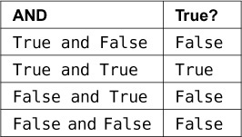
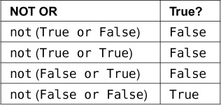
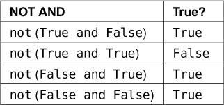
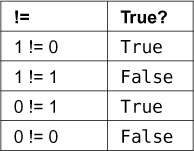
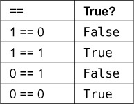

Some important boolean logic things to memorise
===============================================

Negation :
----------
truth table for negation i.e. ``not`` in python

+--------------+-------------+
| NOT          | True?       |
+==============+=============+
| not False    | ``True``    |
+--------------+-------------+
| ``not True`` | ``False``   |
+--------------+-------------+

OR table
--------

+----------------+---------+
| OR             | True?   |
+================+=========+
| True or False  | True    |
+----------------+---------+
| True or True   | True    |
+----------------+---------+
| False or True  | False   |
+----------------+---------+
| False or False | False   |
+----------------+---------+

AND table
----------

not OR truth table
-------------------

not AND truth table
-------------------------

not equal truth table
-------------------------

equal-to comparison truth table
--------------------------------

