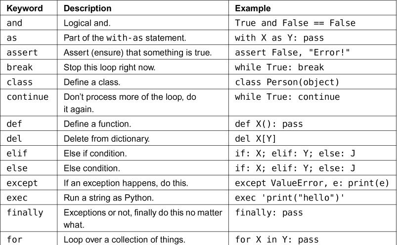
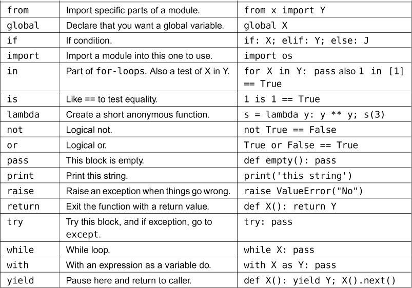
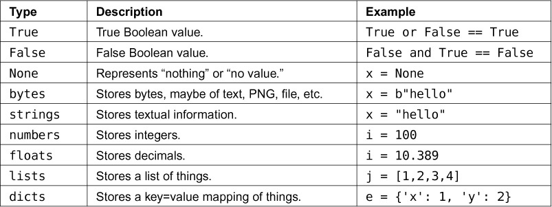
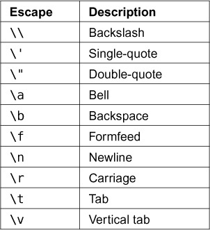
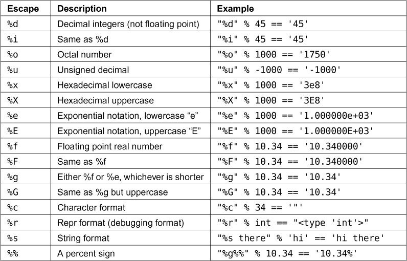
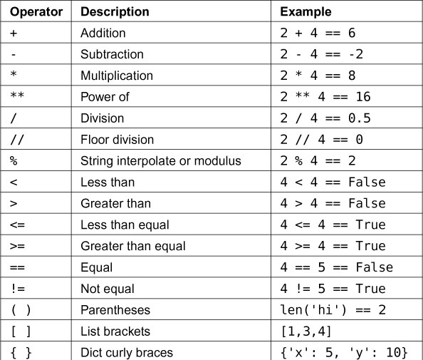
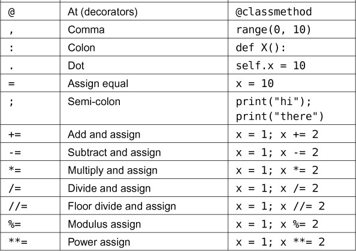

Good listing of Python jargon
=============================

Keywords
^^^^^^^^^
Summary of Python keywords

----------------

Data Types
^^^^^^^^^^^
The Data types in python

String Escape Sequences
^^^^^^^^^^^^^^^^^^^^^^^^

Old Style String Formats
^^^^^^^^^^^^^^^^^^^^^^^^^^^^
Same thing for string formats: use them in some strings to know what they do. Older Python 2 code uses these formatting characters to do what f-strings do. Try them out as an alternative.

Operators
^^^^^^^^^^^
They indicate the operations to be performed on objects

To do
""""""
Read other programmer's code and try to understand

#. the functions and their purpose
#. when variables are assigned for first time
#. check any if-statements without ``else`` are correct
#. for any infinite while loops

